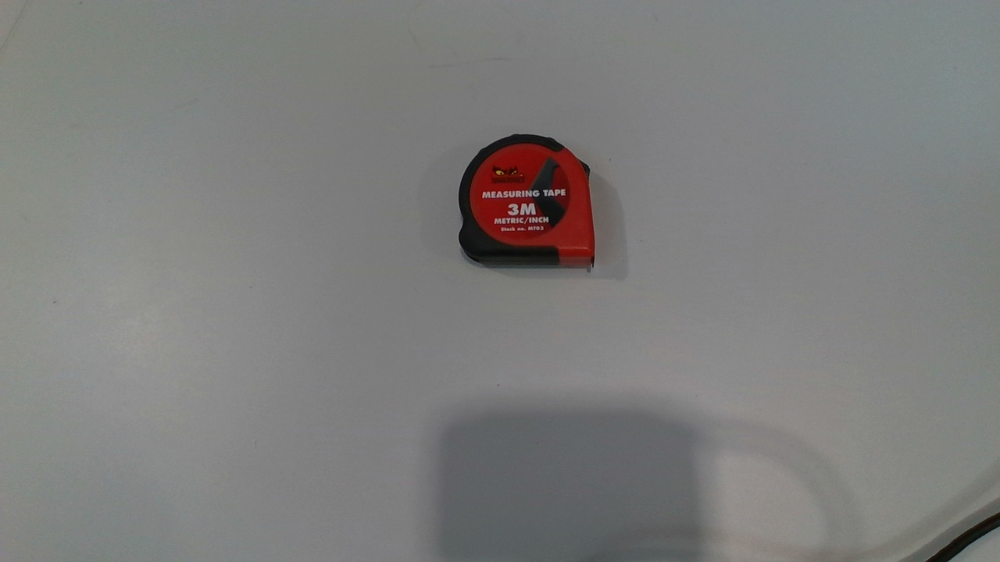
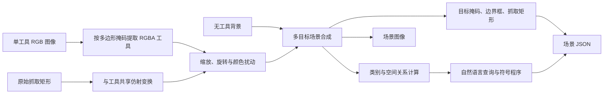

# Grasp-Tools v2：组合式语言引导抓取数据集

Grasp-Tools v2 是 ToolRGS 面向**语言引导目标定位与二维抓取检测**
构建的组合式合成数据集。它以单工具实拍图及其抓取标注为基础，将多个工具经过
抠图、缩放、旋转和颜色扰动后放入新的背景，再为同一场景生成多条具有明确指向
的自然语言查询。

与“每张图只包含一个工具、文本只给出类别名称”的数据相比，v2 同时考察：

- 模型能否从语言中识别目标类别；
- 模型能否理解绝对位置、相对位置和多物体关系；
- 模型能否在相似类别、同类别实例和复杂背景中排除干扰项；
- 模型能否同时预测目标分割掩码与可执行抓取矩形；
- 模型能否适应同义词、近义表达和未在训练集出现过的句式。

> 当前默认设置是**难度 1 入门协议**。建议先验证类别理解和抓取回归，再逐步增加
> 空间关系与干扰项，避免一开始同时引入过多变量。

## 1. 原始数据与标注

仓库已经包含生成数据集所需的全部素材：

```text
assets/grasp_tools/
├── graspall/       # 107 张工具图像 + 107 个 JSON 标注
└── backgrounds/    # 42 张无目标工具的背景图像
```

源数据覆盖 22 个标准类别，包括卷尺、扳手、钳子、螺丝刀、剪刀、锤子、内六角
扳手、胶带、螺母、电缆等。生成器能够读取 107 个有效工具对象；每个对象包含：

- `category`：标准类别名称；
- `mask`：目标物体多边形轮廓；
- `bbox`：物体边界框；
- `grasps`：一组四点式二维抓取矩形；
- `language`：原始数据中的简单抓取指令。

`000000000076.json` 中保留了两个空对象记录用于来源追踪。生成器会显式警告并跳过
它们，不会把无效标注写入新数据集。

### 1.1 真实源图示例

<table>
  <tr>
    <td align="center"></td>
    <td align="center"></td>
    <td align="center"></td>
  </tr>
  <tr>
    <td align="center">卷尺（tape measure）</td>
    <td align="center">钳子（pliers）</td>
    <td align="center">剪刀（scissors）</td>
  </tr>
</table>

源图中的工具会依据多边形掩码被提取出来，原始抓取矩形也会随工具一起进行几何
变换。下面是背景素材示例：


## 2. 数据生成原理

生成过程不是简单复制图片，而是同时维护**视觉、几何和语言**三种一致性：



### 2.1 工具提取

生成器使用源标注中的多边形掩码提取工具，而不是使用矩形框粗略裁剪。边缘会进行
轻微羽化，使合成边界不过于生硬。

### 2.2 几何增强

每个工具被采样一个缩放比例和旋转角度。图像、物体轮廓、边界框及所有抓取矩形
共享同一个仿射变换，因此增强后抓取标注仍与目标对齐。

默认难度 1 使用：

```text
scales = 0.9, 1.0, 1.15, 1.3
angle_bins = 24
```

24 个角度分层覆盖完整的 360°，每个分层宽 15°，并在分层中心附近加入
`±7.5°` 连续扰动。它表示整个数据集会均衡覆盖不同方向，并不表示一张图同时
包含全部角度。

### 2.3 多目标场景合成

生成器在一个背景中放置多个工具，并限制物体越界和不合理重叠。类别采样与角度、
尺度采样采用平衡队列，减少少数类别或少数角度长期占优。

还可以按概率引入两类干扰：

- **同类别干扰**：同一场景中出现两个相同类别，例如两把扳手；
- **困难负样本**：加入视觉或语义相近类别，例如 T 型与 L 型内六角扳手、
  钳子与压线钳、胶带与卷尺。

### 2.4 图像外观增强

亮度、对比度和饱和度扰动用于模拟光照与相机差异。默认入门设置均为 `0.05`，
完整难度设置分别提高到 `0.12、0.12、0.10`。

### 2.5 语言查询生成

同一场景图像只保存一次，配套 JSON 可以包含多条查询。每条查询通过
`target_idx` 指向目标对象，同时保存查询类型、难度和可解释的符号程序。

例如：

```json
{
  "query_id": "train_000001_q00",
  "text": "Please grasp the spanner.",
  "target_idx": 1,
  "type": "category",
  "difficulty": 1,
  "category_term": "spanner",
  "prompt_cycle": "category_v1",
  "program": [
    {"op": "filter_category", "value": "wrench"},
    {"op": "unique"}
  ]
}
```

这里 `spanner` 是 `wrench` 的语言表面形式，标注中的标准类别仍然是 `wrench`。
因此模型可以学习表达变化，而类别统计和评价协议保持稳定。

## 3. 四级语言难度

四个等级是**累积关系**：难度 3 包含难度 1、2、3 的查询，难度 4 包含全部查询。
生成器只在目标能够被唯一确定时写入查询，避免同一句话同时指向多个正确答案。

| 难度 | 查询能力 | 示例 | 生成条件 |
| --- | --- | --- | --- |
| 1 | 类别识别 | `Grasp the wrench.` | 场景中该类别唯一 |
| 2 | 绝对位置 | `Pick up the leftmost object.` | 最左/最右/最上/最下目标与次近目标间距足够 |
| 3 | 同类区分、单参考物关系 | `Select the leftmost wrench.`、`Grasp the object to the right of the screwdriver.`、`Pick up the object closest to the tape measure.` | 关系结果唯一，且参考类别唯一 |
| 4 | 双参考物关系 | `Grasp the object between the pliers and the tape measure.` | 两个参考物唯一，且中间只有一个合格目标 |

### 3.1 难度 1：类别查询

难度 1 只要求根据类别或同义表达找到目标：

```text
Pick up the wrench.
Please grasp the spanner.
Locate and grasp the hand wrench.
Could you pick up the open-end wrench?
```

**只有场景中该类别唯一时，才会生成类别查询。**例如场景中只有一把扳手，
`Grasp the wrench` 是无歧义的；如果场景中有两把扳手，这句话无法确定目标，
生成器会改用“最左侧的扳手”等更具体的难度 3 查询。

默认入门数据关闭同类别与困难负样本，并在每张图中放置 2～3 个不同类别的较大
工具，因此几乎每个对象都可以得到清晰的类别查询。

### 3.2 难度 2：绝对位置

难度 2 在类别查询基础上加入与整幅图像坐标有关的表达：

```text
Grasp the leftmost object.
Pick up the item at the upper edge.
Select the object positioned furthest right.
Retrieve the lowest object in the image.
```

它主要测试模型是否能够把 `leftmost/rightmost/topmost/bottommost` 与视觉坐标
对应起来。生成器要求第一名与第二名之间至少具有足够间隔，防止位置接近导致
歧义。

### 3.3 难度 3：同类区分与单参考物关系

难度 3 包含三组能力。

1. **同类别位置区分**

   ```text
   Grasp the leftmost wrench.
   Pick up the highest screwdriver.
   ```

2. **方向关系**

   ```text
   Select the object immediately to the right of the pliers.
   Grasp the item just above the tape measure.
   ```

3. **距离关系**

   ```text
   Pick up the object closest to the screwdriver.
   Retrieve the object farthest from the wrench.
   ```

方向关系会检查主方向距离和垂直方向偏差；最近/最远关系会检查第一候选与第二候选
的距离比。只有关系足够明显、结果唯一时才保留查询。

### 3.4 难度 4：双参考物关系

难度 4 增加 `between` 关系：

```text
Grasp the object between the pliers and the tape measure.
Pick up the item positioned midway between the wrench and the screwdriver.
```

生成器先连接两个参考物中心，再检查候选目标在线段上的投影位置及垂直距离。
只有一个目标满足“位于两者之间”时才生成该查询。这一等级要求模型同时解析两个
参考物、空间结构和最终目标，通常也是最难的设置。

## 4. 语言多样性与动态 Prompt

数据集使用 22 个训练指令模板，例如：

```text
Pick up ...
Grasp ...
Select ...
Choose ...
Lift ...
Locate and grasp ...
Find and pick up ...
Retrieve ...
```

22 个标准类别各自提供 4 种类别表面形式。例如：

| 标准类别 | 可采样表达 |
| --- | --- |
| `wrench` | wrench、spanner、open-end wrench、hand wrench |
| `tape measure` | tape measure、measuring tape、retractable tape measure、measuring tape tool |
| `pliers` | pliers、pair of pliers、gripping pliers、hand pliers |
| `scissors` | scissors、pair of scissors、cutting scissors、shears |

因此一个难度 1 目标具有 `22 × 4 = 88` 种训练表达组合。开启
`DATA.dynamic_train_prompts` 后：

- 每个目标依据 `dynamic_prompt_seed + scene_id + target_idx` 得到独立、
  可复现的随机顺序；
- 前 88 个 epoch 内不会重复使用同一组合；
- 训练不到 88 个 epoch 也没有问题，只会使用该随机序列的前缀；
- 第 89 个 epoch 开始进入新的随机排列；
- 验证和测试始终使用 JSON 中的固定文本，保证指标可比较。

### 4.1 Shared 与 Held-out 语言协议

- `--language-templates shared`：训练、验证和测试共享模板池，适合最初验证模型
  是否能够学习任务；
- `--language-templates heldout`：验证和测试使用训练阶段未出现的命令前缀和
  描述方式，用于评价语言泛化。

即使使用 `shared`，三个 split 的场景图像与背景划分仍然独立；共享的是语言模板，
不是生成后的图片。

## 5. 数据组织格式

生成结果目录如下：

```text
datasets/grasp-tools/aug_graspall_v2/
├── README.txt
├── metadata.json
├── _preview/
│   ├── train_train_000000.jpg
│   └── train_train_000000.txt
├── train/
│   ├── train_000000.jpg
│   ├── train_000000.json
│   └── index.jsonl
├── val/
│   ├── val_000000.jpg
│   ├── val_000000.json
│   └── index.jsonl
└── test/
    ├── test_000000.jpg
    ├── test_000000.json
    └── index.jsonl
```

一个场景 JSON 的核心结构是：

```json
{
  "schema_version": "2.0",
  "split": "train",
  "scene_id": "train_000000",
  "image_filename": "train_000000.jpg",
  "background_source": "bg12.jpg",
  "image_size": [1280, 720],
  "objects": [
    {
      "object_id": 0,
      "category": "wrench",
      "bbox": [120, 80, 430, 300],
      "mask": [[120, 80], [430, 80], [430, 300], [120, 300]],
      "grasps": [
        [[180, 170], [360, 170], [360, 190], [180, 190]]
      ]
    }
  ],
  "queries": [
    {
      "text": "Grasp the wrench.",
      "target_idx": 0,
      "type": "category",
      "difficulty": 1,
      "program": [
        {"op": "filter_category", "value": "wrench"},
        {"op": "unique"}
      ]
    }
  ]
}
```

`index.jsonl` 每一行对应一条语言查询，而不是一张独立图片。训练加载器通过
`image + annotation + query_index` 找到目标，因此可以复用同一张场景图而无需
重复保存图像。

## 6. 数据划分与评价边界

42 张背景会按固定随机种子划分给 train、val 和 test，同一背景文件不会跨 split
使用。默认 6000/500/1000 设置会生成：

| Split | 场景图片数 | 每图对象数 | 默认每图查询数 |
| --- | ---: | ---: | ---: |
| train | 6000 | 2～3 | 4 |
| val | 500 | 2～3 | 4 |
| test | 1000 | 2～3 | 4 |

默认规划器会在每个 split 内严格平衡 22 类的场景实例、查询目标和同类源实例复用次数。
放置时优先处理面积较大的裁切；若场景拥挤，重试会逐步缩小到基础 scale 的最低 55%，但不会跳过对象或改变配额。
标准设置生成 7500 张场景图片和 30000 条查询（训练 24000、验证 2000、测试 4000）。
若修改场景数或每图查询数，最终数量与均衡审计应以生成后的 metadata.json 为准。

需要明确的是：三个 split 共享同一批 107 个源工具实例，只是背景、组合、位置、
尺度、角度和语言不同。因此该划分适合衡量**组合泛化和语言泛化**，不能单独作为
“未见过物理实例”的证据。真实物体泛化应使用额外拍摄的独立实例测试集。

## 7. 生成步骤

### 7.1 第一步：运行烟雾测试

从 ToolRGSNPU 根目录执行：

```bash
python -u tools/dataset_converters/grasp_tools/augment.py \
  --out-dir /tmp/grasp_tools_v2_smoke \
  --smoke-test \
  --image-ext jpg \
  --overwrite
```

烟雾测试为 train、val、test 各生成 12 张场景，以稳定覆盖全部 22 类。检查：

```text
/tmp/grasp_tools_v2_smoke/_preview
```

预览图会绘制物体轮廓、类别编号和部分抓取矩形；同名 `.txt` 文件列出该场景的
所有查询。

### 7.2 第二步：生成默认均衡入门数据集

默认命令使用难度 1 入门设置，同时保留新版严格类别均衡和稳健放置：

```bash
python -u tools/dataset_converters/grasp_tools/augment.py
```

等价的完整命令为：

```bash
python -u tools/dataset_converters/grasp_tools/augment.py \
  --out-dir datasets/grasp-tools/aug_graspall_v2 \
  --train-scenes 6000 \
  --val-scenes 500 \
  --test-scenes 1000 \
  --objects-min 2 \
  --objects-max 3 \
  --train-queries-per-scene 4 \
  --eval-queries-per-scene 4 \
  --max-query-difficulty 1 \
  --language-templates shared \
  --category-vocabulary expanded \
  --scales 0.9,1.0,1.15,1.3 \
  --angle-bins 24 \
  --same-category-probability 0 \
  --hard-negative-probability 0 \
  --brightness-jitter 0.05 \
  --contrast-jitter 0.05 \
  --saturation-jitter 0.05 \
  --grasp-height 20 \
  --image-ext jpg \
  --jpeg-quality 95
```

### 7.3 第三步：逐步提高难度

推荐采用课程式实验，而不是直接从难度 4 开始：

| 实验 | 关键配置 | 目的 |
| --- | --- | --- |
| D1（默认） | `max-query-difficulty=1`，关闭同类与困难负样本 | 验证类别、分割和抓取基本能力 |
| D2 | `max-query-difficulty=2` | 加入全局绝对位置理解 |
| D3 | `max-query-difficulty=3`，提高 `same-category-probability` | 加入同类区分和单参考物关系 |
| D4 | `max-query-difficulty=4`，每图 3～5 个对象 | 加入双参考物与复杂组合推理 |

完整难度 4 对比数据可使用：

```bash
python -u tools/dataset_converters/grasp_tools/augment.py \
  --out-dir datasets/grasp-tools/aug_graspall_v2_full \
  --train-scenes 3000 \
  --val-scenes 800 \
  --test-scenes 1200 \
  --objects-min 3 \
  --objects-max 5 \
  --train-queries-per-scene 6 \
  --eval-queries-per-scene 4 \
  --max-query-difficulty 4 \
  --language-templates heldout \
  --category-vocabulary canonical \
  --scales 0.6,0.8,1.0,1.25,1.5 \
  --angle-bins 12 \
  --same-category-probability 0.40 \
  --hard-negative-probability 0.30 \
  --brightness-jitter 0.12 \
  --contrast-jitter 0.12 \
  --saturation-jitter 0.10 \
  --grasp-height 20 \
  --image-ext jpg \
  --jpeg-quality 95
```

## 8. 训练 DROG-OFF

Grasp-Tools v2 的关系描述更长，因此配置将 CLIP token 上限设为 32：

```bash
python train.py --config config/grasp_tools/drogoff_v2.yaml
```

八卡 NPU 训练：

```bash
ASCEND_RT_VISIBLE_DEVICES=0,1,2,3,4,5,6,7 \
torchrun --nproc_per_node=8 --master_port=29610 \
  train.py --config config/grasp_tools/drogoff_v2.yaml
```

当前 NPU runner 将 `TRAIN.batch_size` 和 `TRAIN.batch_size_val` 解释为**全局
batch size**，并要求能够被 NPU 数量整除。启动日志会打印每卡 batch、全局 batch、
每轮 step、AMP 状态和各参数组实际学习率。

## 9. 生成后检查清单

正式训练前建议确认：

1. `_preview` 中工具边缘没有明显白边或大面积残缺；
2. 多边形轮廓与目标一致；
3. 抓取矩形随工具旋转、缩放后仍落在合理位置；
4. `.txt` 中每条语言都能唯一指向对应编号的目标；
5. `metadata.json` 中 22 个类别均有样本；
6. train/val/test 的背景文件没有交叉；
7. 难度统计与实验设置一致；
8. `index.jsonl` 的行数与查询总数一致；
9. 关系描述未超过模型配置中的 `word_len=32`；
10. 使用同一随机种子时能够复现实验数据。

## 10. 适用范围与局限

Grasp-Tools v2 的优势是能够低成本控制场景复杂度、语言难度、目标数量、角度分布和
干扰类型，适合做消融实验与课程学习。但合成场景仍可能存在边缘、阴影和遮挡不够
真实的问题，而且共享源工具实例会限制真实实例泛化结论。

因此建议把它用于：

- 语言模板、同义词和空间关系的消融研究；
- 多任务分割与抓取表达的对比；
- DROG-OFF 等模型的快速预训练和稳定性分析；
- 难度 1 → 4 的课程学习实验。

最终真实机器人结论还应结合独立物体、真实遮挡、深度噪声和物理抓取实验。
